# Automation Tools & Pipeline

This document outlines the automation tools and scripts for the full content pipeline.

> **Solo Creator Workflow**: This pipeline is designed for a single-person operation. AI handles the thinking/writing collaboration, automation handles the repetitive tasks, and you stay in creative control.

---

## Pipeline Overview

```mermaid
flowchart LR
    subgraph AI["🧠 AI-Assisted"]
        A[Develop Script]
        B[Draft Content]
    end

    subgraph Manual["🎬 You Execute"]
        C[Record Video]
        D[Edit Video]
    end

    subgraph Auto["⚙️ Automated"]
        E[Transcribe]
        F[Upload]
        G[Publish]
    end

    A --> B --> C --> D --> E --> F --> G

    style AI fill:#f0fdf4,stroke:#16a34a
    style Manual fill:#e0f2fe,stroke:#0284c7
    style Auto fill:#fef3c7,stroke:#f59e0b
```



### The Three Layers

| Layer | What Happens | Tools |
|-------|--------------|-------|
| **🧠 AI-Assisted** | Brainstorm, structure, draft scripts, create outlines | Claude, ChatGPT, other LLMs |
| **🎬 You Execute** | Record, direct, edit, make creative decisions | Camera, OBS, DaVinci Resolve |
| **⚙️ Automated** | Transcribe, format, upload, cross-post | Whisper, YouTube API, scripts |

### What's Automated vs AI-Assisted vs Manual

| Phase | AI-Assisted | Manual | Automated |
|-------|-------------|--------|-----------|
| **Content Dev** | Script structure, drafts, outlines | Final approval | - |
| **Pre-Production** | Talking points, blog drafts | Research validation | Folder creation |
| **Production** | - | Recording, directing | - |
| **Post-Production** | - | Editing decisions | Transcription, captions |
| **Distribution** | Show notes, social posts | Review, approve | Upload, metadata |

---

## Tool Stack

### Current Architecture

```mermaid
flowchart TD
    subgraph Conversation["🧠 AI Collaboration"]
        IDEA[Video Idea] --> CLAUDE[Claude / LLM]
        CLAUDE --> SCRIPT_DRAFT[Script Draft]
        CLAUDE --> OUTLINE[Outline]
        CLAUDE --> BLOG_DRAFT[Blog Draft]
        CLAUDE --> NOTES[Show Notes]
    end

    subgraph Local["💻 Local Machine"]
        SCRIPT_DRAFT --> SCRIPT_MD[script.md]
        NEW_EP[new-episode.sh] --> FOLDER[Episode Folder]

        VID[Video File] --> WHISPER[Whisper Model]
        WHISPER --> SRT[SRT Captions]
    end

    subgraph Cloud["☁️ Cloud Services"]
        SRT --> YT_API[YouTube Data API]
        VID --> YT_API
        META[metadata.yml] --> YT_API
        YT_API --> YOUTUBE[(YouTube)]
    end

    subgraph Future["🔮 Future"]
        YOUTUBE --> SHORTS[Auto Shorts]
        YOUTUBE --> SOCIAL[Social Posts]
        SRT --> BLOG_GEN[Blog Generation]
    end

    style Conversation fill:#f0fdf4,stroke:#16a34a
    style Local fill:#e0f2fe,stroke:#0284c7
    style Cloud fill:#fce7f3,stroke:#db2777
    style Future fill:#f3e8ff,stroke:#9333ea
```



### AI Collaboration Tools

The conversational development phase uses LLMs to help structure and draft content:

| Tool | Best For | Notes |
|------|----------|-------|
| **Claude** | Long-form scripts, technical accuracy | Excellent at structure and nuance |
| **Claude Code** | Scripts + code samples, diagrams | Can generate Mermaid, code examples |
| **ChatGPT** | Quick brainstorms, alternatives | Good for rapid iteration |
| **Local LLMs** | Privacy, offline work | Ollama, LM Studio |

**Typical AI-assisted outputs:**
- Script drafts (saved to `script.md`)
- Content outlines
- Talking points for extemporaneous recording
- Blog post drafts
- YouTube descriptions and show notes
- Social media post drafts

### Live Streaming & OBS

For live streams, OBS (Open Broadcaster Software) is the hub for managing multiple inputs, scenes, and outputs.


**OBS Setup for Solo Creator:**

| Component | Recommendation | Notes |
|-----------|----------------|-------|
| **Scenes** | 4-5 scenes | Talking, Screen, PiP, Video, BRB |
| **Hotkeys** | F1-F5 for scenes | Quick switching during stream |
| **Recording** | Always record locally | Backup + VOD for editing |
| **Encoder** | x264 or NVENC | GPU encoding if available |
| **Bitrate** | 6000 kbps | Adjust for your upload speed |

**Key OBS Plugins:**
- **Advanced Scene Switcher** - Auto-switch scenes based on triggers
- **Source Dock** - Better source management
- **Move Transition** - Smooth scene transitions
- **Closed Captions** - Live captions via Google/cloud

**Scene Switching for Video Commentary:**


### Remote Interviews (Zoom/Jitsi)

For guest interviews via video conferencing (Zoom, Jitsi via Zulip, Google Meet, etc.).


**Platform Comparison:**

| Platform | Best For | Recording |
|----------|----------|-----------|
| **Zoom** | Professional interviews | Local + cloud, separate tracks |
| **Jitsi (Zulip)** | Quick internal calls | OBS capture |
| **Riverside.fm** | Podcast quality | Local per-participant |
| **Discord** | Community guests | OBS capture |

**OBS Interview Scenes:**

| Hotkey | Scene | Use |
|--------|-------|-----|
| F1 | Side-by-Side | Normal conversation |
| F2 | Guest Focus | Guest explaining |
| F3 | Host Focus | You explaining |
| F4 | Screen Share | Demos, content |

**Pro Tips:**
- Always start OBS recording before platform recording
- Ask guest to wear headphones (prevents echo)
- Record your mic directly, not through conference app
- Request guest's local recording if quality matters

### Media Assets & Thumbnails

Tools for creating and managing visual assets.


**Tool Recommendations:**

| Asset | Tool | Notes |
|-------|------|-------|
| **Thumbnails** | Figma, Canva | Templates speed up creation |
| **Logos** | Figma, Illustrator | Export SVG + PNG |
| **Intros/Outros** | After Effects, DaVinci | Keep project files |
| **Lower Thirds** | After Effects, Premiere | Motion graphics |
| **AI Backgrounds** | Midjourney, DALL-E | For thumbnail elements |
| **Quick Graphics** | Canva | Fast and easy |

**Thumbnail Quick Tips:**
- 1280x720 minimum
- Face + emotion increases CTR
- 2-4 words max
- Use templates for consistency
- Test at small size (mobile preview)

**Asset Storage:**
```
assets/
├── branding/           # Logos, brand guide
├── thumbnails/         # Templates, elements
├── intros/             # Intro clips
├── outros/             # End screens
├── overlays/           # Lower thirds, graphics
├── music/              # Background, stingers
└── sound-effects/      # UI sounds, transitions
```

> 📄 Brand guide: [`assets/branding/brand-guide.md`](../assets/branding/brand-guide.md)

### Transcription & Captions

**Primary: OpenAI Whisper (Local)**
- Free, runs entirely on your machine
- No API calls, no usage limits
- Excellent accuracy for technical content

```bash
# Install Whisper locally
pip install openai-whisper

# Or install latest from GitHub
pip install git+https://github.com/openai/whisper.git
```

**Alternatives:**
| Tool | Pros | Cons |
|------|------|------|
| Whisper API | Faster, no GPU needed | Paid per minute |
| AssemblyAI | Speaker diarization | Paid, requires API |
| YouTube Auto | Zero effort | Lower accuracy, delayed |

### YouTube Upload

**YouTube Data API v3** - Official API for programmatic uploads

```bash
# Install dependencies
pip install google-api-python-client google-auth-oauthlib
pip install simple-youtube-api  # Optional wrapper
```

### Multi-Platform Publishing

For solo creators, start simple and expand:


---

## Automation Scripts

### Script Overview

```mermaid
flowchart LR
    subgraph Available["✅ Available Now"]
        NEW[new-episode.sh]
        TRANS[transcribe.py]
    end

    subgraph Planned["📋 Planned"]
        UP[upload.py]
        THUMB[thumbnail.py]
        PUB[publish.py]
    end

    NEW -->|Creates| FOLDER[Episode Folder]
    TRANS -->|Generates| SRT[Captions]
    UP -->|Sends to| YT[YouTube]
    THUMB -->|Creates| IMG[Thumbnail]
    PUB -->|Posts to| SOCIAL[Social Media]

    style Available fill:#d1fae5,stroke:#10b981
    style Planned fill:#fef3c7,stroke:#f59e0b
```



### `scripts/new-episode.sh`

Creates a new episode folder with all templates.

```bash
# Usage
./scripts/new-episode.sh series-name episode-topic

# Example
./scripts/new-episode.sh dollhouse-mcp mcp-server-basics

# Creates:
# series/dollhouse-mcp/2024-12-23-mcp-server-basics/
#   ├── script.md
#   ├── metadata.yml
#   ├── notes.md
#   ├── raw/camera/
#   ├── raw/screen/
#   ├── assets/
#   └── exports/
```

**Flow:**

```mermaid
sequenceDiagram
    participant You
    participant Script as new-episode.sh
    participant FS as File System
    participant Git as Git Repo

    You->>Script: ./new-episode.sh series topic
    Script->>Script: Generate date prefix
    Script->>FS: Create episode folder
    Script->>FS: Create subfolders (raw, assets, exports)
    Script->>FS: Copy script-template.md → script.md
    Script->>FS: Copy metadata-template.yml → metadata.yml
    Script->>FS: Create notes.md
    Script-->>You: Episode folder ready!
    You->>Git: git add & commit (optional)
```



### `scripts/transcribe.py`

Generates SRT captions from video/audio using Whisper.

```bash
# Basic usage
python scripts/transcribe.py path/to/video.mp4

# With specific model
python scripts/transcribe.py video.mp4 --model large-v3

# Different output format
python scripts/transcribe.py video.mp4 --format vtt

# Output: path/to/video.srt
```

**Model Selection:**


| Model | Speed | Accuracy | VRAM | Best For |
|-------|-------|----------|------|----------|
| `tiny` | ⚡⚡⚡⚡ | ⭐ | ~1GB | Quick drafts |
| `base` | ⚡⚡⚡ | ⭐⭐ | ~1GB | Simple content |
| `small` | ⚡⚡ | ⭐⭐⭐ | ~2GB | General use |
| `medium` | ⚡ | ⭐⭐⭐⭐ | ~5GB | Technical content |
| `large-v3` | 🐢 | ⭐⭐⭐⭐⭐ | ~10GB | Maximum accuracy |
| **`turbo`** | ⚡⚡⚡ | ⭐⭐⭐⭐ | ~6GB | **Recommended** |

**Transcription Flow:**


### `scripts/upload.py` (Planned)

Will upload video to YouTube with metadata from YAML.

```bash
# Planned usage
python scripts/upload.py path/to/episode/

# Reads: exports/final.mp4 + metadata.yml
# Outputs: YouTube video ID
```

**Planned Flow:**


---

## Setup Requirements

### Quick Start


### 1. Python Environment

```bash
# Create virtual environment
python -m venv .venv
source .venv/bin/activate  # macOS/Linux
# or: .venv\Scripts\activate  # Windows

# Install dependencies
pip install -r requirements.txt
```

### 2. YouTube API Credentials (for upload.py)


**Steps:**
1. Go to [Google Cloud Console](https://console.cloud.google.com)
2. Create new project or select existing
3. Navigate to APIs & Services → Enable APIs
4. Search for and enable "YouTube Data API v3"
5. Go to Credentials → Create Credentials → OAuth 2.0 Client ID
6. Application type: Desktop app
7. Download the JSON file
8. Rename to `client_secrets.json`
9. Place in `scripts/` directory

### 3. OpenAI API Key (optional, for Whisper API)

Only needed if using the hosted API instead of local Whisper:

```bash
export OPENAI_API_KEY="your-key-here"
```

---

## Solo Creator Workflow Examples

### Daily Workflow

```mermaid
flowchart TD
    subgraph Dev["🧠 Content Development (Anytime)"]
        A0[Chat with Claude about next video] --> A1[Develop script together]
        A1 --> A2[Save draft to episode folder]
    end

    subgraph Morning["☀️ Morning - Creative Work"]
        B1[Review/finalize script] --> B2[Prep demo environment]
        B2 --> B3[Record video]
    end

    subgraph Afternoon["🌤️ Afternoon - Production"]
        C1[Edit in DaVinci/Premiere] --> C2[Export final video]
    end

    subgraph Automated["⚙️ Automated"]
        D1[Run transcribe.py] --> D2[Review captions]
        D2 --> D3[Upload to YouTube]
    end

    subgraph Evening["🌙 Evening - Optional"]
        E1[Schedule publish time]
        E2[Draft social posts with AI]
    end

    Dev --> Morning --> Afternoon --> Automated --> Evening

    style Dev fill:#f0fdf4,stroke:#16a34a
```



**Typical session flow:**
1. **Develop** - Conversation with Claude to flesh out the idea and draft script
2. **Prep** - Review script, set up your recording environment
3. **Record** - Execute the content (you're the performer)
4. **Edit** - Make creative decisions about pacing and visuals
5. **Automate** - Let scripts handle transcription and upload
6. **Publish** - Quick review, schedule, and optionally draft social posts with AI

### Batch Processing Day

When you have multiple videos ready:

```bash
# Transcribe all exports
for episode in series/*/exports/*.mp4; do
    echo "Transcribing: $episode"
    python scripts/transcribe.py "$episode"
done

# Future: batch upload
# for episode in series/*/; do
#     python scripts/upload.py "$episode"
# done
```


### Weekly Content Schedule


---

## Future Enhancements

### Roadmap

```mermaid
flowchart TD
    subgraph Now["✅ Available Now"]
        N1[new-episode.sh]
        N2[transcribe.py]
    end

    subgraph Next["🔜 Next Up"]
        X1[upload.py - YouTube upload]
        X2[Batch processing improvements]
    end

    subgraph Later["📋 Later"]
        L1[thumbnail.py - AI thumbnails]
        L2[chapters.py - Auto chapter detection]
        L3[shorts.py - Extract Shorts clips]
    end

    subgraph Future["🔮 Future"]
        F1[blog.py - Transcript to blog post]
        F2[social.py - Multi-platform posting]
        F3[analytics.py - Dashboard integration]
    end

    Now --> Next --> Later --> Future
```



### Planned Features

- [ ] **upload.py** - YouTube upload with metadata from YAML
- [ ] **thumbnail.py** - AI-generated thumbnails (DALL-E/Midjourney API)
- [ ] **chapters.py** - Auto-detect chapters from script headings
- [ ] **shorts.py** - Extract vertical clips using silence detection
- [ ] **blog.py** - Convert transcript to blog post with code blocks
- [ ] **social.py** - Post to Twitter/LinkedIn/Discord
- [ ] **analytics.py** - Pull YouTube analytics into metadata.yml

---

## Resources

### Documentation
- [YouTube Data API Docs](https://developers.google.com/youtube/v3/guides/uploading_a_video)
- [OpenAI Whisper GitHub](https://github.com/openai/whisper)
- [OpenAI Speech-to-Text Guide](https://platform.openai.com/docs/guides/speech-to-text)

### Tools & Libraries
- [tokland/youtube-upload](https://github.com/tokland/youtube-upload) - CLI YouTube uploader
- [simple-youtube-api](https://pypi.org/project/simple-youtube-api/) - Python wrapper
- [pillargg/youtube-upload](https://github.com/pillargg/youtube-upload) - Another Python option

### Tutorials
- [DigitalOcean: Whisper + FFmpeg Subtitles](https://www.digitalocean.com/community/tutorials/how-to-generate-and-add-subtitles-to-videos-using-python-openai-whisper-and-ffmpeg)
- [n8n YouTube Automation Workflow](https://n8n.io/workflows/3442-fully-automated-ai-video-generation-and-multi-platform-publishing/)

### Solo Creator Resources
- [Primal Video - Content Creation Process](https://primalvideo.com/video-creation/shooting/video-content-creation-our-process-from-youtube-video-idea-to-release/)
- [Ali Abdaal - Part-Time YouTuber Academy](https://www.youtube.com/@aliabdaal) (workflow inspiration)

---

*Designed for solo creators who want automation without complexity.*
