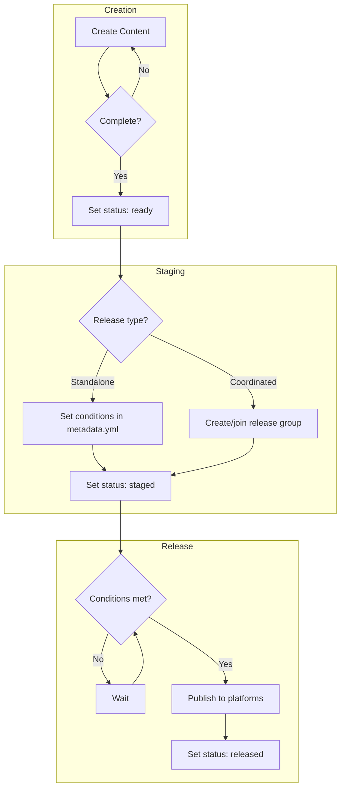

# Content Staging & Release Workflow

This document explains the content escrow system - how to stage content, coordinate releases, and manage dependencies.

---

## Overview

The staging system lets you:
- **Hold content** until a specific time or condition
- **Coordinate releases** across multiple content pieces
- **Sync with external events** (product launches, repo releases, etc.)
- **Control distribution** per content item or release group

```
┌─────────┐    ┌─────────┐    ┌─────────┐    ┌──────────┐
│  Draft  │ →  │  Ready  │ →  │ Staged  │ →  │ Released │
└─────────┘    └─────────┘    └─────────┘    └──────────┘
     ↑              ↑              ↑               ↑
  Working       Complete      Waiting for      Published
  on it         content       condition
```

---

## Content Status

Every piece of content has a `content_status` in its `metadata.yml`:

| Status | Meaning |
|--------|---------|
| `draft` | Still being created - scripting, recording, or editing |
| `ready` | Content complete, awaiting staging decision |
| `staged` | Queued for release, may have conditions/dependencies |
| `released` | Published to platforms |

```yaml
# metadata.yml
content_status: staged
```

---

## Standalone Releases

For content released on its own (not coordinated with other content):

### Time-Based Release

```yaml
# metadata.yml
content_status: staged

release:
  target_date: 2025-01-15T09:00:00-08:00
  notes: "New Year content push"
```

### Condition-Based Release

```yaml
# metadata.yml
content_status: staged

release:
  depends_on:
    - "merview repo public"
  notes: "Waiting for repo to go public"
```

### Time + Condition

```yaml
# metadata.yml
content_status: staged

release:
  target_date: 2025-01-15T09:00:00-08:00
  depends_on:
    - "v1.0 shipped"
  notes: "Release on Jan 15, but only after v1.0 ships"
```

---

## Coordinated Releases

For multiple content pieces released together:

### 1. Create a Release Group

In `release-queue.yml`:

```yaml
release_groups:
  merview-launch:
    name: "Merview Public Launch"
    description: "Coordinated content for Merview going public"
    status: staged
    target_date: 2025-01-15T09:00:00-08:00
    condition: "Merview repository made public"
    items:
      - path: series/merview/2024-12-20-intro
        type: youtube
        distribution: full
      - path: series/merview/2024-12-21-getting-started
        type: youtube
        distribution: youtube-blog
    dependencies:
      - "merview repo public"
      - "landing page live"
    release_order:
      - youtube
      - blog
      - linkedin
      - bluesky
      - mastodon
```

### 2. Link Content to Group

In each episode's `metadata.yml`:

```yaml
content_status: staged

release:
  release_group: merview-launch
```

### 3. Release the Group

When conditions are met:
1. Update `release_groups.merview-launch.status` to `released`
2. Update each item's `content_status` to `released`
3. Move entry to `released` section for history

---

## Distribution Profiles

Control which platforms receive each piece of content.

### Using Presets

```yaml
# metadata.yml
distribution:
  profile: full    # All platforms
```

Available profiles (defined in `distribution-profiles.yml`):

| Profile | Platforms |
|---------|-----------|
| `full` | YouTube, Blog, LinkedIn, Blue Sky, Mastodon |
| `youtube-blog` | YouTube + Blog |
| `youtube-only` | YouTube only |
| `blog-only` | Blog only |
| `minimal` | YouTube + LinkedIn |
| `social-only` | LinkedIn, Blue Sky, Mastodon |

### Custom Platform List

```yaml
# metadata.yml
distribution:
  platforms:
    - youtube
    - blog
    - linkedin
```

---

## Workflow Diagram



---

## Release Checklist

When releasing staged content:

### Standalone Release

- [ ] Verify all dependencies satisfied
- [ ] Check target date/time is appropriate
- [ ] Review distribution profile/platforms
- [ ] Publish to each platform in order
- [ ] Update `content_status: released` in metadata.yml
- [ ] Add to `released` section in release-queue.yml (optional)

### Coordinated Release

- [ ] Verify all items in group are ready
- [ ] Check all dependencies for the group
- [ ] Verify target date/time
- [ ] Publish each item per `release_order`
- [ ] Update `status: released` on release group
- [ ] Update `content_status: released` on each item
- [ ] Move group to `released` section in release-queue.yml

---

## Blocking Content

If content is ready but blocked on external factors:

```yaml
# release-queue.yml
blocked:
  - path: series/ailish/2024-12-10-demo
    status: blocked
    blocked_by: "Waiting for API access approval"
    blocked_since: 2024-12-15
    notes: "Check back after holidays"
```

And in the content's `metadata.yml`:

```yaml
content_status: ready  # or staged
release:
  notes: "BLOCKED: Waiting for API access approval"
```

---

## Quick Reference

### Status Transitions

```
draft → ready       Content complete
ready → staged      Decision made to hold for release
staged → released   Conditions met, published
ready → released    Direct publish (no staging)
```

### Key Files

| File | Purpose |
|------|---------|
| `metadata.yml` (per episode) | Content status, release conditions, distribution |
| `release-queue.yml` | Release groups, staged items, history |
| `distribution-profiles.yml` | Platform presets |

### Common Commands

```bash
# Find all staged content
grep -r "content_status: staged" series/

# Find content in a release group
grep -r "release_group: merview-launch" series/

# List all release groups
yq '.release_groups | keys' release-queue.yml
```

---

## Examples

### Example 1: Simple Scheduled Release

You've finished a holiday video and want to release it on New Year's Day.

```yaml
# series/dollhouse-mcp/2024-12-25-holiday/metadata.yml
content_status: staged

distribution:
  profile: full

release:
  target_date: 2025-01-01T10:00:00-08:00
  notes: "New Year release"
```

### Example 2: Waiting for Product Launch

Video about a new feature that isn't shipped yet.

```yaml
# series/merview/2024-12-20-new-feature/metadata.yml
content_status: staged

distribution:
  profile: youtube-blog

release:
  depends_on:
    - "Merview v2.0 released"
  notes: "Publish same day as v2.0"
```

### Example 3: Coordinated Launch Campaign

Multiple videos, blog post, and social content for a product launch.

```yaml
# release-queue.yml
release_groups:
  ailish-beta:
    name: "Ailish Beta Launch"
    status: staged
    target_date: 2025-02-01T09:00:00-08:00
    items:
      - path: series/ailish/2025-01-15-intro
        distribution: full
      - path: series/ailish/2025-01-20-demo
        distribution: youtube-blog
      - path: series/ailish/2025-01-25-tutorial
        distribution: youtube-blog
    dependencies:
      - "Beta signup page live"
      - "Documentation published"
    release_order:
      - youtube
      - blog
      - linkedin
      - bluesky
      - mastodon
```

Each video's `metadata.yml`:

```yaml
content_status: staged
release:
  release_group: ailish-beta
```
