# Content Creation Workflow Guide

> Complete guide to creating, producing, and publishing video content for DollhouseMCP projects.

```
┌─────────────────────────────────────────────────────────────────┐
│  🎬 SOLO CREATOR WORKFLOW                                       │
│                                                                 │
│  This system is designed for a single person handling all       │
│  aspects of content creation - from scripting to publishing.    │
│  Automation handles the repetitive parts so you can focus on    │
│  the creative work that requires human judgment.                │
└─────────────────────────────────────────────────────────────────┘
```

## Table of Contents

- [Overview](#overview)
- [Workflow Diagram](#workflow-diagram)
- [Repository Structure](#repository-structure)
- [Phase 1: Pre-Production](#phase-1-pre-production)
- [Phase 2: Production](#phase-2-production)
- [Phase 3: Post-Production](#phase-3-post-production)
- [Phase 4: Distribution](#phase-4-distribution)
- [Automation Pipeline](#automation-pipeline)
- [Best Practices](#best-practices)
- [Tools & Resources](#tools--resources)

---

## Overview

This workflow system is designed for a **solo creator** producing technical video content about:

| Project | Description | Content Focus |
|---------|-------------|---------------|
| **Dollhouse MCP** | MCP server ecosystem | Tutorials, updates, demos |
| **Merview** | Code review platform | Feature walkthroughs, use cases |
| **MCP AQL** | Agent Query Language | Technical deep-dives |
| **Ailish** | AI assistant | Capability showcases |

### Solo Creator Philosophy

You're not alone - AI is your creative collaborator for ideation and scripting, while automation handles the repetitive production tasks.


**The three-part workflow:**

| Layer | Role | Examples |
|-------|------|----------|
| **You** | Creative director, performer | Recording, editing decisions, final approval |
| **AI** | Thinking partner, writer | Script drafts, structure, blog posts, show notes |
| **Automation** | Production assistant | Captions, uploads, file organization |

### Key Principles

1. **Solo-First Design** - Every workflow fits a one-person operation
2. **AI-Assisted Development** - Conversational scripting with Claude/LLMs
3. **Hybrid Organization** - Series folders with date-prefixed episodes
4. **Mixed Recording** - Camera + screen capture as needed
5. **Automation Where It Counts** - Transcription, metadata, publishing
6. **Documentation as Code** - Everything in git, markdown-based

---

## Workflow Diagram

### High-Level Pipeline


### AI-Assisted Content Development

The script development process is conversational - you work with Claude or other LLMs to develop, refine, and structure your content through discussion.


**How this typically works:**


**Content types you might develop:**

| Output | Use Case | AI Helps With |
|--------|----------|---------------|
| **Video Script** | YouTube main content | Structure, hooks, flow, examples |
| **Talking Points** | Extemporaneous recording | Key beats to hit, transitions |
| **Blog Post** | Written companion | Expanding transcript, SEO |
| **Show Notes** | Video description | Summaries, timestamps, links |
| **Social Posts** | Promotion | Hooks, thread structure |

### Detailed Process Flow


### File State Transitions

```mermaid
stateDiagram-v2
    [*] --> Idea
    Idea --> Scripted
    Scripted --> Recorded
    Recorded --> Edited
    Edited --> Captioned
    Captioned --> Uploaded
    Uploaded --> Published
    Published --> Promoted
    Promoted --> [*]

    Idea: 💡 Idea
    Scripted: 📝 Scripted
    Recorded: 🎬 Recorded
    Edited: ✂️ Edited
    Captioned: 💬 Captioned
    Uploaded: ☁️ Uploaded
    Published: 🌐 Published
    Promoted: 📣 Promoted
```



**State Details:**

| State | Files Created | Key Action |
|-------|---------------|------------|
| Idea | - | Topic identified and validated |
| Scripted | `script.md`, `metadata.yml` | Script written and reviewed |
| Recorded | `raw/` folder populated | Footage captured |
| Edited | Project files | Post-production complete |
| Captioned | `video.srt` | `transcribe.py` run |
| Uploaded | - | Video on YouTube (private) |
| Published | - | Made public, metadata applied |
| Promoted | `notes.md` updated | Social posts sent, analytics tracked |

---

## Repository Structure

```
content-workflow/
├── series/                          # 📁 Video projects by series
│   ├── dollhouse-mcp/
│   │   └── 2024-12-23-getting-started/
│   │       ├── script.md            # Episode script
│   │       ├── metadata.yml         # YouTube metadata
│   │       ├── notes.md             # Production notes
│   │       ├── raw/                 # Raw footage (gitignored)
│   │       │   ├── camera/
│   │       │   └── screen/
│   │       ├── assets/              # Episode-specific assets
│   │       └── exports/             # Final outputs (gitignored)
│   ├── merview/
│   ├── mcp-aql/
│   └── ailish/
│
├── assets/                          # 🎨 Shared media assets
│   ├── branding/                    # Logos, colors, fonts
│   ├── intros/                      # Intro video clips
│   ├── outros/                      # Outro/end screen clips
│   ├── overlays/                    # Lower thirds, graphics
│   ├── music/                       # Background music, stingers
│   ├── sound-effects/               # Transition sounds, etc.
│   └── thumbnails/                  # Thumbnail templates
│
├── templates/                       # 📝 Reusable templates
│   ├── script-template.md           # Script structure
│   ├── metadata-template.yml        # YouTube metadata fields
│   └── description-template.md      # Description format
│
├── checklists/                      # ✅ Production checklists
│   ├── pre-production.md
│   ├── production.md
│   ├── post-production.md
│   └── distribution.md
│
├── scripts/                         # 🤖 Automation scripts
│   ├── new-episode.sh               # Create episode folder
│   └── transcribe.py                # Generate captions
│
├── docs/                            # 📚 Documentation
│   ├── workflow-guide.md            # This document
│   └── automation-tools.md          # Tools reference
│
├── assets/                          # 🎨 Shared assets
│   └── branding/                    # Logos, intros, outros
│
├── requirements.txt                 # Python dependencies
└── .gitignore                       # Excludes media files
```

### Episode Folder Structure

Each episode follows this structure:


> ⚠️ Red folders are **gitignored** - large media files stay local or in cloud storage

---

## Media Assets

Media assets are the reusable visual and audio elements that give your content consistent branding.

### Asset Types

```mermaid
flowchart TD
    subgraph Branding["🎨 Branding Assets"]
        LOGO[Logos]
        COLORS[Color Palette]
        FONTS[Fonts]
    end

    subgraph Video["📹 Video Assets"]
        INTRO[Intro Clips]
        OUTRO[Outro Clips]
        LOWER[Lower Thirds]
        OVERLAY[Overlays/Graphics]
        BG[Backgrounds]
    end

    subgraph Audio["🔊 Audio Assets"]
        MUSIC[Background Music]
        STINGER[Stingers/Transitions]
        SFX[Sound Effects]
    end

    subgraph Thumbnails["🖼️ Thumbnail Assets"]
        TEMPLATE[Templates]
        ELEMENTS[Design Elements]
        PHOTOS[Headshots/Photos]
    end

    Branding --> Video
    Branding --> Thumbnails
    Audio --> Video
```



### Asset Folder Structure

```
assets/
├── branding/
│   ├── logos/
│   │   ├── dollhouse-mcp-logo.png
│   │   ├── dollhouse-mcp-logo.svg
│   │   └── dollhouse-mcp-icon.png
│   ├── colors.md                 # Color codes and usage
│   └── fonts/                    # Custom fonts if any
│
├── intros/
│   ├── main-intro-5s.mp4         # Standard 5-second intro
│   ├── short-intro-2s.mp4        # Quick version
│   └── intro-project-files/      # Source files (After Effects, etc.)
│
├── outros/
│   ├── end-screen-20s.mp4        # YouTube end screen template
│   ├── subscribe-cta.mp4         # Subscribe call-to-action
│   └── outro-project-files/
│
├── overlays/
│   ├── lower-thirds/
│   │   ├── name-title.png        # Your name/title graphic
│   │   ├── guest-lower-third.psd # Template for guests
│   │   └── topic-banner.png
│   ├── subscribe-button.png
│   ├── like-reminder.png
│   └── screen-frames/            # Frames for screen recordings
│
├── music/
│   ├── background/
│   │   ├── chill-tech-loop.mp3
│   │   └── upbeat-intro.mp3
│   ├── stingers/
│   │   ├── transition-whoosh.mp3
│   │   └── section-change.mp3
│   └── licenses/                 # License files for any paid music
│       └── track-licenses.md
│
├── sound-effects/
│   ├── ui-click.mp3
│   ├── success-chime.mp3
│   ├── error-buzz.mp3
│   └── typing.mp3
│
└── thumbnails/
    ├── templates/
    │   ├── tutorial-template.psd
    │   ├── announcement-template.psd
    │   └── interview-template.psd
    ├── elements/
    │   ├── arrows.png
    │   ├── boxes.png
    │   └── emoji-set.png
    └── photos/
        └── headshot.png
```

### Branding Guidelines

Your brand guide (`assets/branding/brand-guide.md`) should define:

**Colors:**
- Primary: `#[hex]` - Used for: titles, accents
- Secondary: `#[hex]` - Used for: backgrounds, highlights
- Text: `#[hex]` - Used for: body text, captions
- Background: `#[hex]` - Used for: video backgrounds

**Fonts:**
- Titles: [Font Name] - Bold, size 48-72px
- Body: [Font Name] - Regular, size 24-32px
- Code: [Monospace Font] - For code samples

**Logo Usage:**
- Minimum size: 100px width
- Clear space: 20px around logo
- Placement: Top-left or bottom-right corner

**Thumbnail Style:**
- Always include face (increases CTR)
- Max 3-4 words of text
- High contrast colors
- Consistent template per series

> 📄 Full template: [`assets/branding/brand-guide.md`](../assets/branding/brand-guide.md)

### Thumbnail Creation

Thumbnails significantly impact click-through rate. Create templates for consistency.


**Thumbnail Checklist:**
- [ ] 1280x720 pixels minimum (16:9 ratio)
- [ ] File size under 2MB
- [ ] Readable at small size (mobile)
- [ ] Face showing emotion (if applicable)
- [ ] 2-4 words of text maximum
- [ ] High contrast between text and background
- [ ] Consistent with series branding
- [ ] No misleading imagery (YouTube policy)

**Thumbnail Templates by Content Type:**

| Type | Elements | Example |
|------|----------|---------|
| **Tutorial** | Face + Topic icon + "How to..." | Your face, code icon, "Build MCP Server" |
| **Announcement** | Logo + News graphic + Bold text | Logo, sparkle effect, "NEW FEATURE" |
| **Interview** | Both faces + Guest name | Side-by-side, guest name prominent |
| **Explainer** | Diagram/visual + Question | Architecture diagram, "What is MCP?" |

### Intro/Outro Guidelines

**Intro (3-5 seconds max):**
- Logo animation
- Channel name
- Optional: Series name
- Keep short - viewers skip long intros

**Outro (15-20 seconds):**
- End screen compatible (YouTube requirements)
- Subscribe CTA
- Video recommendations placeholders
- Social links


### Audio Asset Guidelines

**Background Music:**
- Volume: -20 to -25 dB (under voice)
- Style: Consistent per series
- Licensing: Use royalty-free or licensed music
- Sources: Epidemic Sound, Artlist, YouTube Audio Library (free)

**Sound Effects:**
- Use sparingly
- Match your style (subtle vs. energetic)
- Consistent sounds for repeated actions

**Music License Tracking:**

Keep track of licenses in `assets/music/licenses/track-licenses.md`:

| Track | Source | License | Expiry |
|-------|--------|---------|--------|
| chill-tech-loop.mp3 | YouTube Audio Library | Free | Never |
| upbeat-intro.mp3 | Epidemic Sound | Subscription | 2025-12-31 |

| Effect | Source | License |
|--------|--------|---------|
| whoosh.mp3 | Freesound.org | CC0 |

> 📄 Full template: [`assets/music/licenses/track-licenses.md`](../assets/music/licenses/track-licenses.md)

### Asset Creation Tools

| Asset Type | Recommended Tools | Notes |
|------------|-------------------|-------|
| **Logos** | Figma, Illustrator | Export SVG + PNG |
| **Thumbnails** | Figma, Canva, Photoshop | Templates speed up creation |
| **Intros/Outros** | After Effects, DaVinci Resolve, Canva | Keep source files |
| **Lower Thirds** | After Effects, Premiere, DaVinci | Motion graphics |
| **Music** | YouTube Audio Library, Epidemic Sound | Check licenses |
| **AI Thumbnails** | Midjourney, DALL-E, Ideogram | For backgrounds/elements |

### Episode-Specific Assets

Each episode can have its own assets in the `assets/` folder:

```
series/dollhouse-mcp/2024-12-23-getting-started/
├── assets/
│   ├── thumbnail.png           # Episode thumbnail
│   ├── thumbnail.psd           # Source file
│   ├── diagrams/
│   │   ├── architecture.png
│   │   └── flow-chart.png
│   ├── screenshots/
│   │   ├── step-1.png
│   │   └── step-2.png
│   └── b-roll/
│       └── demo-clip.mp4
```

### Asset Checklist for New Episode

Before recording:
- [ ] Thumbnail concept/sketch ready
- [ ] Any diagrams or graphics created
- [ ] Screenshots captured (if walkthrough)
- [ ] B-roll footage identified or recorded

After editing:
- [ ] Final thumbnail created and exported
- [ ] Thumbnail saved to episode assets folder
- [ ] Any new reusable assets moved to shared `assets/`

---

## Phase 1: Pre-Production

### Creating a New Episode

```bash
# Navigate to repo
cd /Users/mick/Developer/DollhouseMCP\ Org/content-workflow

# Create new episode
./scripts/new-episode.sh dollhouse-mcp getting-started

# Output:
# Creating episode: series/dollhouse-mcp/2024-12-23-getting-started
# Episode created successfully!
```

This creates:

```
series/dollhouse-mcp/2024-12-23-getting-started/
├── script.md         # From templates/script-template.md
├── metadata.yml      # From templates/metadata-template.yml
├── notes.md          # Fresh notes file
├── raw/
│   ├── camera/
│   └── screen/
├── assets/
└── exports/
```

### Script Structure

The script template provides a proven structure:

> **[Video Title]**
>
> **Series**: Dollhouse MCP | **Episode**: Getting Started | **Target Length**: 10 minutes

| Section | Timing | Purpose |
|---------|--------|---------|
| **Hook** | 0:00 - 0:30 | Grab attention immediately |
| **Intro** | 0:30 - 1:00 | What we'll cover, why it matters |
| **Main Content** | 1:00 - 8:00 | Sections 1, 2, 3... |
| **Demo/Walkthrough** | varies | Screen recording, live coding |
| **Recap** | Last 1-2 min | Key takeaways (3 points) |
| **Call to Action** | End | Subscribe, like, check out repo |

**Example hook:**
> "Ever wished you could give AI tools direct access to your development environment? That's exactly what MCP does..."

> 📄 Full template: [`templates/script-template.md`](../templates/script-template.md)

### Metadata Configuration

```yaml
# metadata.yml
title: "Getting Started with Dollhouse MCP"
description: |
  Learn how to set up your first MCP server...

  ## Timestamps
  0:00 - Intro
  0:30 - What is MCP?

tags:
  - MCP
  - AI
  - Developer Tools

category: 28  # Science & Tech

recording:
  date: "2024-12-23"
  format: "4K"

status:
  scripted: true
  recorded: false
  edited: false
  uploaded: false
  published: false
```

> 📄 Full template: [`templates/metadata-template.yml`](../templates/metadata-template.yml)

### Pre-Production Checklist

Before recording, complete the checklist:


> ✅ Full checklist: [`checklists/pre-production.md`](../checklists/pre-production.md)

---

## Phase 2: Production

### Recording Setup


### Recording Types

| Type | When to Use | Tips |
|------|-------------|------|
| **Camera only** | Announcements, opinions, intros | Energy up, eye contact with lens |
| **Screen only** | Code tutorials, demos | Narrate everything, deliberate mouse |
| **Mixed** | Most technical content | Sync with clap, plan transitions |
| **Live Stream** | Real-time engagement, Q&A, long-form | OBS scenes, backup recording |
| **Remote Interview** | Guest discussions, Zoom/Jitsi calls | Capture both sides, backup record |

### Live Streaming Workflow

Live streaming uses OBS (Open Broadcaster Software) to manage multiple inputs, scenes, and real-time switching.


#### OBS Scene Setup

| Scene | Sources | Use Case |
|-------|---------|----------|
| **Talking Head** | Camera, mic, lower third | Direct commentary, intros |
| **Screen Share** | Display capture, mic, small camera | Demos, code walkthrough |
| **Picture-in-Picture** | Screen + camera overlay | Showing while explaining |
| **Video Playback** | Media source, mic | Playing clips, commenting over |
| **BRB / Starting Soon** | Static image, music | Breaks, pre-stream |

#### Live Stream Architecture


#### Live Stream Prep Checklist

**Technical:**
- [ ] OBS scenes configured and tested
- [ ] Stream key entered (YouTube/Twitch)
- [ ] Bitrate appropriate for connection (6000 kbps typical)
- [ ] Local recording enabled (backup!)
- [ ] Audio levels tested (-12 to -6 dB peaks)
- [ ] All video sources active

**Content:**
- [ ] Talking points/outline ready (not full script)
- [ ] Assets loaded (videos, images, demos)
- [ ] Browser tabs pre-loaded
- [ ] Code samples ready
- [ ] Chat/alerts visible if interacting

**Environment:**
- [ ] Notifications disabled (DND mode)
- [ ] Phone silenced
- [ ] Lighting consistent
- [ ] Background clean

**Hotkeys (customize in OBS):**

| Action | Key |
|--------|-----|
| Scene: Talking | F1 |
| Scene: Screen | F2 |
| Scene: PiP | F3 |
| Scene: Video | F4 |
| Mute/Unmute | F9 |
| Start/Stop Recording | F10 |

> ✅ Full checklist: [`checklists/live-streaming.md`](../checklists/live-streaming.md)

#### Talking Over Pre-recorded Content

When you want to show a video while providing live commentary:


**Audio setup for video commentary:**
- Video audio: -20 dB (background level)
- Your mic: 0 dB (full level)
- Use OBS audio ducking or manual fader

#### Post-Stream Workflow

After a live stream, the VOD can enter the normal post-production pipeline:


### Remote Interview Workflow

For guest interviews and discussions via Zoom, Jitsi (Zulip), or other video conferencing tools.

```mermaid
flowchart TD
    subgraph Conference["📞 Video Conference"]
        GUEST[Guest Video/Audio]
        YOU[Your Video/Audio]
        SHARE[Screen Share]
    end

    subgraph Capture["🎬 Recording Methods"]
        direction TB
        OBS_CAP[OBS Window Capture]
        PLATFORM[Platform Recording]
        LOCAL[Local Camera/Mic]
    end

    subgraph Output["📁 Outputs"]
        COMBINED[Combined Recording]
        SEPARATE[Separate Tracks]
        BACKUP[Platform Backup]
    end

    Conference --> Capture
    OBS_CAP --> COMBINED
    OBS_CAP --> SEPARATE
    PLATFORM --> BACKUP
    LOCAL --> SEPARATE

    style Conference fill:#3b82f6,color:#fff
    style Capture fill:#9333ea,color:#fff
```



#### Video Conference Platforms

| Platform | Pros | Cons | Recording Options |
|----------|------|------|-------------------|
| **Zoom** | Ubiquitous, stable | Paid for longer calls | Cloud + local, separate tracks |
| **Jitsi (Zulip)** | Free, integrated | Less polished | Local only via OBS |
| **Google Meet** | Easy for Google users | Limited recording | Cloud only (host) |
| **Discord** | Good for tech community | Variable quality | OBS capture required |
| **Riverside.fm** | Studio quality, separate tracks | Paid | Local recording per participant |

#### Capture Setup with OBS


**OBS Setup for Remote Interviews:**

1. **Window Capture** - Capture the Zoom/Jitsi window
2. **Your Camera** - Separate source for higher quality local video
3. **Audio Sources:**
   - Your mic (direct input, not through conference)
   - Desktop audio (captures guest audio)
4. **Scenes:**
   - Side-by-side (both participants)
   - Guest focus (guest large, you small)
   - Screen share (when showing content)

#### Interview Recording Best Practices


**Audio Tips for Remote Interviews:**
- Ask guest to use headphones (prevents echo)
- Record your mic directly in OBS (not through conference app)
- Capture desktop audio for guest's voice
- Consider having guest record locally too (send file after)

#### Multi-Track Recording

For best editing flexibility, record separate tracks:

```
interview-episode/
├── raw/
│   ├── obs-combined.mkv      # Full OBS recording
│   ├── your-camera.mov       # Your local camera (if separate)
│   ├── zoom-recording.mp4    # Platform backup
│   └── guest-local.mp4       # Guest's local recording (if available)
└── audio/
    ├── your-mic.wav          # Your direct mic recording
    └── desktop-audio.wav     # Guest audio from conference
```

#### Interview Scene Templates

| Scene | Layout | When to Use |
|-------|--------|-------------|
| **Side-by-Side** | 50/50 split | Normal conversation |
| **Guest Focus** | Guest 80%, you 20% PiP | Guest is explaining |
| **Host Focus** | You 80%, guest 20% PiP | You're explaining |
| **Screen Share** | Screen 80%, participants 20% | Showing demos/content |
| **Gallery** | Equal tiles | 3+ participants |

### File Organization During Recording

```bash
# After recording session, organize files:
episode-folder/
├── raw/
│   ├── camera/
│   │   ├── take-01.mov
│   │   ├── take-02.mov      # Multiple takes OK
│   │   └── b-roll.mov
│   ├── screen/
│   │   ├── demo-part1.mp4
│   │   └── demo-part2.mp4
│   └── interview/           # For remote interviews
│       ├── obs-combined.mkv
│       ├── zoom-backup.mp4
│       └── guest-local.mp4  # If guest sent their recording
└── audio/
    ├── room-tone.wav        # 10 sec silence for editing
    └── guest-audio.wav      # Separate guest track if available
```

> ✅ Full checklist: [`checklists/production.md`](../checklists/production.md)

---

## Phase 3: Post-Production

### Editing Workflow


### Audio Standards

```yaml
# YouTube recommended audio specs
loudness: -14 LUFS      # Integrated loudness
true_peak: -1.0 dB      # Maximum peak level
sample_rate: 48000      # 48 kHz
bit_depth: 24           # 24-bit
```

### Generating Captions

Use the included transcription script:

```bash
# Basic usage
python scripts/transcribe.py path/to/video.mp4

# Specify model (turbo is fastest with good accuracy)
python scripts/transcribe.py video.mp4 --model turbo

# Output different format
python scripts/transcribe.py video.mp4 --format vtt

# Available models (accuracy vs speed tradeoff):
# tiny    -> fastest, least accurate
# base    -> fast, decent accuracy
# small   -> balanced
# medium  -> good accuracy
# large-v3 -> best accuracy, slowest
# turbo   -> optimized large, recommended
```

**How it works:**

```mermaid
sequenceDiagram
    participant User
    participant Script as transcribe.py
    participant Whisper
    participant Output as .srt file

    User->>Script: python transcribe.py video.mp4
    Script->>Script: Load Whisper model
    Script->>Whisper: Transcribe audio
    Whisper-->>Script: Segments with timestamps
    Script->>Script: Format as SRT
    Script->>Output: Write video.srt
    Script-->>User: Done: video.srt created
```

**Output format (SRT):**

```srt
1
00:00:00,000 --> 00:00:03,500
Ever wished you could give AI tools
direct access to your development environment?

2
00:00:03,500 --> 00:00:06,200
That's exactly what MCP does.

3
00:00:06,500 --> 00:00:09,800
In this video, I'll show you how to
get started with Dollhouse MCP.
```

> 📄 Script reference: [`scripts/transcribe.py`](../scripts/transcribe.py)

### Export Settings

```yaml
# Recommended YouTube export settings
video:
  codec: H.264 (x264)
  resolution: 3840x2160  # 4K, or 1920x1080 for 1080p
  frame_rate: 30         # or 60 for screen capture
  bitrate: 35-45 Mbps    # 4K, or 8-12 Mbps for 1080p

audio:
  codec: AAC
  bitrate: 384 kbps
  sample_rate: 48000

container: MP4
```

> ✅ Full checklist: [`checklists/post-production.md`](../checklists/post-production.md)

---

## Phase 4: Distribution

### Publishing Workflow

```mermaid
flowchart TD
    subgraph Upload
        A[Upload to YouTube] --> B[Set to Private]
        B --> C[Upload thumbnail]
        C --> D[Upload captions .srt]
    end

    subgraph Metadata
        E[Apply title] --> F[Paste description]
        F --> G[Add tags]
        G --> H[Set category]
        H --> I[Add to playlist]
    end

    subgraph Enhancements
        J[Add end screen] --> K[Add cards]
        K --> L[Verify chapters]
    end

    subgraph Publish
        M{Ready?} -->|Yes| N[Schedule or Publish]
        M -->|No| O[Review & Fix]
        O --> M
        N --> P[Set to Public]
    end

    Upload --> Metadata --> Enhancements --> Publish
```

### YouTube Metadata Best Practices

```yaml
title:
  # Keep under 60 characters
  # Front-load keywords
  # Include hook or benefit
  good: "MCP Tutorial: Build Your First AI Tool Server in 10 Minutes"
  bad: "My video about MCP servers and how to build them"

description:
  # First 2-3 lines appear in search - make them count
  # Include timestamps (creates chapters)
  # Add relevant links
  # End with hashtags

tags:
  # 5-8 relevant tags
  # Mix broad and specific
  - MCP                          # Broad
  - Model Context Protocol       # Specific
  - AI Development              # Broad
  - Claude AI Tools             # Specific
  - Dollhouse MCP Tutorial      # Long-tail
```

### Multi-Platform Distribution

```mermaid
graph TD
    MAIN[Main Video] --> YT[YouTube Full Video]
    MAIN --> CLIPS[Extract Clips]
    MAIN --> TRANSCRIPT[Transcript]

    subgraph Video["📹 Video Platforms"]
        YT
        SHORT[YouTube Shorts]
    end

    subgraph Written["📝 Written Content"]
        BLOG[Blog Post]
        LINKEDIN_POST[LinkedIn Post]
    end

    subgraph Social["💬 Social Platforms"]
        LINKEDIN[LinkedIn]
        BLUESKY[Blue Sky]
        MASTODON[Mastodon]
    end

    CLIPS --> SHORT
    TRANSCRIPT --> BLOG
    TRANSCRIPT --> LINKEDIN_POST

    YT --> |"Share link + blurb"| Social

    style MAIN fill:#ff0000,color:#fff
    style YT fill:#ff0000,color:#fff
    style SHORT fill:#ff0000,color:#fff
    style BLOG fill:#3b82f6,color:#fff
```

**Platforms (in order of priority):**

| Platform | Content Type | Notes |
|----------|--------------|-------|
| **YouTube** | Full video, Shorts | Primary platform |
| **Blog** | Written companion | SEO, detailed content |
| **LinkedIn** | Post + link | Professional audience |
| **Blue Sky** | Short post + link | Growing dev community |
| **Mastodon** | Post + link | Tech-savvy audience |

> ❌ **Avoiding Twitter/X** - Deliberately excluded from this workflow.

### Content Repurposing Workflow

From one video, create multiple pieces of content:

```mermaid
flowchart TD
    subgraph Source["📹 Source Content"]
        VIDEO[Published Video]
        TRANSCRIPT[Transcript/Captions]
    end

    subgraph AI["🧠 AI-Assisted Creation"]
        CLAUDE[Chat with Claude]
        CLAUDE --> BLOG_DRAFT[Blog Post Draft]
        CLAUDE --> LINKEDIN_DRAFT[LinkedIn Post]
        CLAUDE --> BLUESKY_DRAFT[Blue Sky Post]
        CLAUDE --> MASTODON_DRAFT[Mastodon Post]
        CLAUDE --> SHORT_SCRIPT[Shorts Script]
    end

    subgraph Output["📤 Published Content"]
        BLOG_FINAL[Blog Post]
        LINKEDIN_FINAL[LinkedIn]
        BLUESKY_FINAL[Blue Sky]
        MASTODON_FINAL[Mastodon]
        SHORTS[YouTube Shorts]
    end

    VIDEO --> TRANSCRIPT
    TRANSCRIPT --> AI
    VIDEO --> |"Extract clips"| SHORTS

    BLOG_DRAFT --> BLOG_FINAL
    LINKEDIN_DRAFT --> LINKEDIN_FINAL
    BLUESKY_DRAFT --> BLUESKY_FINAL
    MASTODON_DRAFT --> MASTODON_FINAL
    SHORT_SCRIPT --> SHORTS

    style AI fill:#f0fdf4,stroke:#16a34a
```

#### AI-Assisted Content Repurposing

Use Claude to transform your video content:

```
You: "Here's my video transcript about [topic].
     Can you help me create:
     1. A blog post that expands on the key points
     2. A LinkedIn post announcing the video
     3. A short Blue Sky post
     4. A Mastodon post"

Claude: [Drafts all four pieces, customized for each platform]
```

| Output | AI Prompt Approach |
|--------|-------------------|
| **Blog Post** | "Expand this transcript into a detailed blog post with code examples" |
| **LinkedIn** | "Write a professional post highlighting the key insight, link in comments" |
| **Blue Sky** | "Write a casual 300-char post with the main hook" |
| **Mastodon** | "Write a 500-char post with relevant hashtags for tech audience" |
| **YouTube Shorts** | "Identify the best 30-60 second segment for a Short" |

#### Content Repurposing Table

| Source | Output | Method | Template |
|--------|--------|--------|----------|
| Full video | YouTube Shorts | Extract 30-60s highlights | - |
| Transcript | Blog post | AI-assisted expansion | `templates/blog-post-template.md` |
| Transcript | LinkedIn post | AI-assisted, professional tone | `templates/social-posts-template.md` |
| Transcript | Blue Sky post | AI-assisted, casual | `templates/social-posts-template.md` |
| Transcript | Mastodon post | AI-assisted, tech-focused | `templates/social-posts-template.md` |
| Key frames | Social images | Screenshot + text overlay | - |
| Full video | Podcast | Extract audio (optional) | - |

#### Cross-Posting Schedule

```mermaid
gantt
    title Content Distribution Timeline
    dateFormat  YYYY-MM-DD

    section Day 0
    YouTube Video Publish    :d0, 2024-01-01, 1d

    section Same Day
    LinkedIn Post            :d1, 2024-01-01, 1d
    Blue Sky Post            :d2, 2024-01-01, 1d
    Mastodon Post            :d3, 2024-01-01, 1d

    section Day 1-2
    Blog Post                :d4, 2024-01-02, 1d
    YouTube Shorts           :d5, 2024-01-02, 2d
```

> 📄 Templates: [`templates/social-posts-template.md`](../templates/social-posts-template.md) | [`templates/blog-post-template.md`](../templates/blog-post-template.md)

> ✅ Full checklist: [`checklists/distribution.md`](../checklists/distribution.md)

---

## Automation Pipeline

### Current Tools

```mermaid
graph LR
    subgraph Available[Currently Available]
        A[new-episode.sh] --> B[Creates folder structure]
        C[transcribe.py] --> D[Generates SRT captions]
    end

    subgraph Planned[Future Automation]
        E[upload.py] --> F[YouTube API upload]
        G[thumbnail.py] --> H[AI thumbnail generation]
        I[publish.py] --> J[Multi-platform posting]
    end

    style Available fill:#4ade80,color:#000
    style Planned fill:#fbbf24,color:#000
```

### Quick Reference

```bash
# Create new episode
./scripts/new-episode.sh [series] [topic]

# Transcribe video to SRT
python scripts/transcribe.py path/to/video.mp4

# Transcribe with specific model
python scripts/transcribe.py video.mp4 --model large-v3

# Batch transcribe folder
for f in exports/*.mp4; do
    python scripts/transcribe.py "$f"
done
```

### Setup Requirements

```bash
# 1. Create Python environment
python -m venv .venv
source .venv/bin/activate

# 2. Install dependencies
pip install -r requirements.txt

# 3. (Future) YouTube API setup
# - Go to Google Cloud Console
# - Enable YouTube Data API v3
# - Create OAuth credentials
# - Download client_secrets.json to scripts/
```

> 📄 Full automation docs: [`docs/automation-tools.md`](./automation-tools.md)

---

## Best Practices

### Content Strategy

```mermaid
mindmap
  root((Content Strategy))
    Consistency
      Regular schedule
      Brand identity
      Familiar format
    Value First
      Solve problems
      Save time
      Teach skills
    Engagement
      Ask questions
      Reply to comments
      Build community
    Optimization
      SEO titles
      Thumbnails
      Timestamps
```

### Technical Content Tips

| Do | Don't |
|----|-------|
| Show, don't just tell | Wall of code without explanation |
| Zoom in on important code | Tiny unreadable text |
| Pause when switching context | Rush through complex parts |
| Provide repo links | Expect viewers to type code |
| Use consistent terminal theme | Dark terminal in bright video |

### Recording Best Practices

1. **Hook viewers in first 30 seconds** - State the problem and promise the solution
2. **Script the intro, improvise the demo** - Natural demos feel more authentic
3. **Multiple takes are OK** - Edit them together seamlessly
4. **Record room tone** - 10 seconds of silence helps in editing
5. **Check audio first** - Bad audio kills videos faster than bad video

### YouTube Algorithm (2025)

```mermaid
pie title What YouTube Measures
    "Watch Time" : 35
    "Click-Through Rate" : 25
    "Engagement" : 20
    "Session Time" : 15
    "Freshness" : 5
```

**Key metrics to optimize:**
- **CTR**: Thumbnail + Title (aim for 4-10%)
- **Average View Duration**: Hook + pacing (aim for 50%+)
- **Engagement**: Likes, comments, shares

---

## Tools & Resources

### Software Stack

| Category | Recommended | Alternatives |
|----------|-------------|--------------|
| **Screen Capture** | OBS Studio | ScreenFlow, Camtasia |
| **Video Editing** | DaVinci Resolve | Premiere Pro, Final Cut |
| **Audio** | Audacity | Adobe Audition |
| **Thumbnails** | Figma | Canva, Photoshop |
| **Transcription** | Whisper (local) | AssemblyAI, Rev |

### External Resources

**YouTube & Content Creation:**
- [YouTube Creator Academy](https://creatoracademy.youtube.com/)
- [Primal Video - Content Creation Process](https://primalvideo.com/video-creation/shooting/video-content-creation-our-process-from-youtube-video-idea-to-release/)
- [Ziflow - Video Production Workflow](https://www.ziflow.com/blog/video-production-workflow)

**Automation & Tools:**
- [YouTube Data API Documentation](https://developers.google.com/youtube/v3/guides/uploading_a_video)
- [OpenAI Whisper GitHub](https://github.com/openai/whisper)
- [n8n Video Automation Workflows](https://n8n.io/workflows/3442-fully-automated-ai-video-generation-and-multi-platform-publishing/)
- [DigitalOcean Whisper + FFmpeg Tutorial](https://www.digitalocean.com/community/tutorials/how-to-generate-and-add-subtitles-to-videos-using-python-openai-whisper-and-ffmpeg)

**Developer YouTube Channels (for reference):**
- [Fireship](https://www.youtube.com/@Fireship) - Fast, distilled explainers
- [Traversy Media](https://www.youtube.com/@TraversyMedia) - Tutorial series format
- [The Coding Train](https://www.youtube.com/@TheCodingTrain) - Engaging personality

### Internal Documents

| Document | Purpose |
|----------|---------|
| [`README.md`](../README.md) | Repository overview |
| [`templates/script-template.md`](../templates/script-template.md) | Script structure |
| [`templates/metadata-template.yml`](../templates/metadata-template.yml) | YouTube metadata |
| [`templates/description-template.md`](../templates/description-template.md) | Description format |
| [`checklists/pre-production.md`](../checklists/pre-production.md) | Pre-production tasks |
| [`checklists/production.md`](../checklists/production.md) | Recording tasks |
| [`checklists/post-production.md`](../checklists/post-production.md) | Editing tasks |
| [`checklists/distribution.md`](../checklists/distribution.md) | Publishing tasks |
| [`docs/automation-tools.md`](./automation-tools.md) | Automation reference |

---

## Appendix: Episode Lifecycle

```mermaid
gantt
    title Episode Production Timeline (Example)
    dateFormat  YYYY-MM-DD
    section Pre-Production
    Research & Outline     :a1, 2024-01-01, 1d
    Script Writing         :a2, after a1, 1d
    Asset Preparation      :a3, after a2, 1d
    section Production
    Recording              :b1, after a3, 1d
    section Post-Production
    Editing                :c1, after b1, 2d
    Captions & Export      :c2, after c1, 1d
    section Distribution
    Upload & Metadata      :d1, after c2, 1d
    Publish & Promote      :d2, after d1, 1d
```

> **Note**: This timeline is illustrative. Actual time varies by content complexity and your workflow efficiency.

---

*Last updated: December 2024*
*Repository: [DollhouseMCP/content-workflow](https://github.com/DollhouseMCP/content-workflow)*
