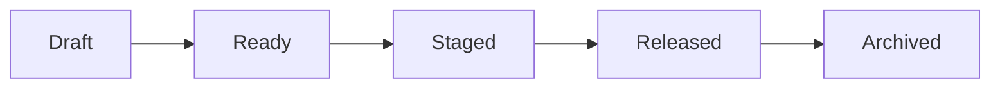

# Getting Started with Content Workflow Toolkit

**Series**: Sample Series
**Episode**: 001
**Target Length**: 10 minutes
**Recording Style**: [x] Screen Capture  [ ] Camera  [ ] Mixed

---

## Hook (0:00 - 0:30)

> "Tired of juggling spreadsheets, folders, and sticky notes to manage your content pipeline? Today I'll show you how the Content Workflow Toolkit can transform your solo creator workflow."

## Intro (0:30 - 1:00)

Welcome back! In this video, we're exploring the **Content Workflow Toolkit** - an open-source dashboard and automation system built specifically for solo content creators.

We'll cover:
- Setting up the local dashboard
- Creating your first episode
- Using the asset browser
- Tracking your content pipeline

## Main Content

### Section 1: Dashboard Overview

The dashboard gives you a bird's-eye view of your entire content operation:

- **Pipeline View**: Kanban-style board showing content status
- **Episode Cards**: Quick access to metadata, files, and progress
- **Asset Browser**: Browse shared assets like intros, music, and graphics

```bash
cd dashboard
npm install
npm start
```

### Section 2: Creating an Episode

The `new-episode.sh` script sets up everything you need:

```bash
./scripts/new-episode.sh my-series episode-topic
```

This creates:
- Folder structure (raw, audio, assets, exports)
- Script template
- Metadata file
- Notes document

### Section 3: Content Pipeline Stages



Each piece of content flows through these stages:
1. **Draft**: Still being worked on
2. **Ready**: Complete, awaiting scheduling
3. **Staged**: Queued for release
4. **Released**: Published to platforms
5. **Archived**: Historical reference

## Demo/Walkthrough

Let me show you the dashboard in action...

1. Open http://localhost:3000
2. Navigate to the Episodes view
3. Click on an episode card
4. Preview the media files
5. Check the workflow progress

## Recap

1. **Dashboard** provides visual overview of your content
2. **Scripts** automate repetitive setup tasks
3. **Templates** ensure consistency across episodes

## Call to Action

If you found this helpful:
- Star the repo on GitHub
- Subscribe for more content creator tools
- Share your workflow tips in the comments!

---

## B-Roll / Visual Notes

- [x] Dashboard screenshot
- [x] Terminal showing script execution
- [ ] Asset browser navigation
- [ ] Episode detail view

## Code Samples

See `scripts/new-episode.sh` for the episode creation automation.

## Resources to Mention

- GitHub: https://github.com/DollhouseMCP/content-workflow-toolkit
- Documentation: See /docs folder

## Recording Notes

- Use dark mode for terminal demos
- Zoom to 150% for readability
- Include mouse cursor for navigation
